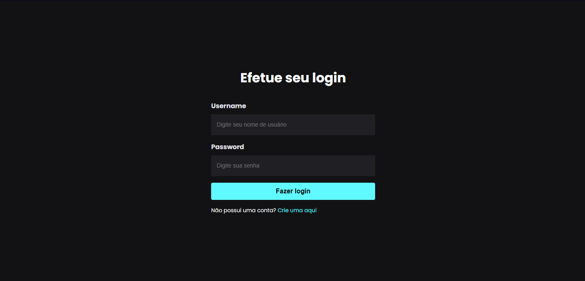
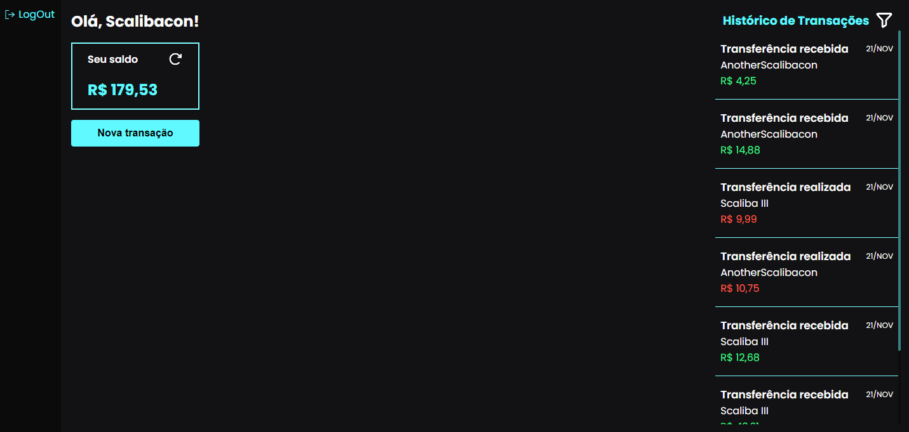
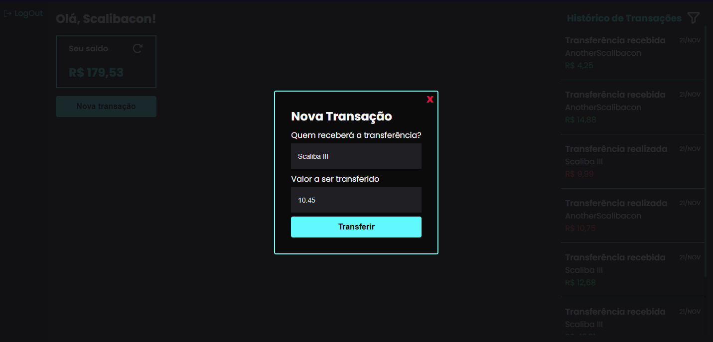
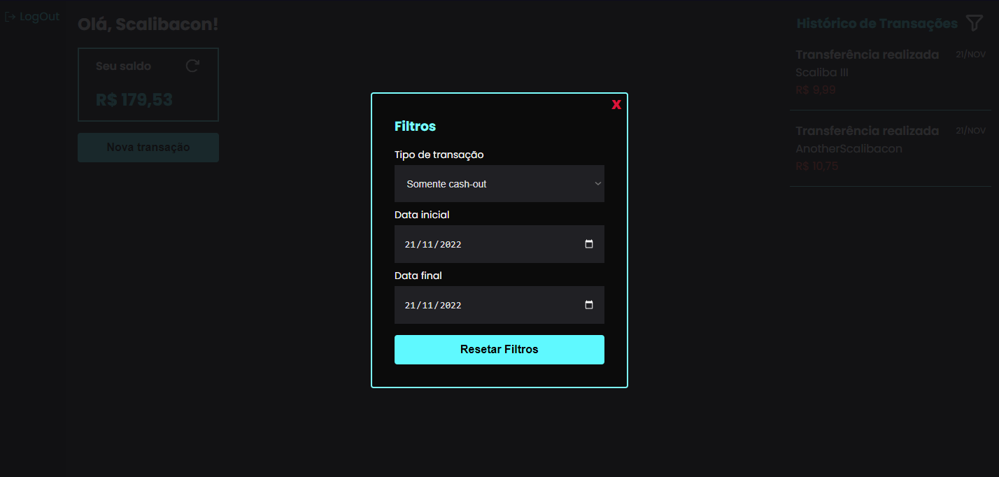
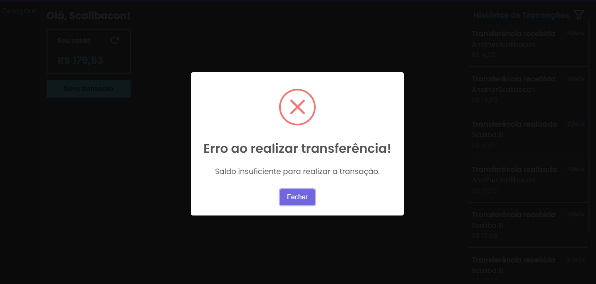

## 💲 Mini App Financeiro 💲

Um app full stack feito para simular transações financeiras. Nele é possível fazer um cadastro, logar, realizar/receber transações e listar as transações que o usuário participou.

## Tecnologias

Para essa aplicação foram usadas diversas ferramentas e tecnologias. A linguagem em geral foi o TypeScript, com Node.js no back-end e NextJS com React front-end. Também foi usado o PostgreSQL como banco de dados juntamente com o Prisma como ORM. E tudo isso com Docker em volta.

## Execução

Existem algumas maneiras de executar esse projeto. Para funcionar corretamente seria necessário criar um arquivo .env na raiz do projeto, onde ficaria armazenada a sua URL de conexão com o banco. Mas pra manter as coisas simples e práticas já vou deixar esse arquivo disponível e funcional.

### Com Docker
Caso tenha o Docker instalado na sua máquina, a execução dessa aplicação se torna bem simples. Basta iniciar o serviço do Docker e executar o seguinte comando na raiz do projeto: 
```shell
docker-compose up
```

### Sem docker
Caso não tenha o Docker disponível na sua máquina o processo é um pouco mais demorado. Antes de mais nada é necessário ter o node, o npm e o postgres instalados na sua máquina. Caso já os tenha aí, é preciso nas pastas "backend" e "frontend" e executar o comando para instalar as dependências:
```shell
npm install
```

Além disso, é necessário alterar a URL de conexão no arquivo ".env" localizado na pasta backend, afim de que seja possível se conectar ao seu postgres. 
```shell
postgresql://[SEU_USUARIO]:[SUA_SENHA]@[ENDEREÇO_IP]:[PORTA]/mini-banco?connect_timeout=300
```

Caso a URL esteja correta, entre na pasta "backend" e execute o comando:
```shell
npx prisma migrate dev --name init
```

Isso irá iniciar o banco de dados do Prisma. Caso tudo dê certo, entre nas pastas "backend" e "frontend" e execute o seguinte comando em cada uma delas:
```shell
npm run dev
```

Esse comando irá subir as aplicações (back-end e front-end). Para verificar se tudo deu certo é só ir para a URL [localhost:3000](http://localhost:3000) e ver se tá tudo funcionando. Caso não esteja, veja se não esqueceu algum passo e, caso não, opte por usar Docker.

## Galeria











## TO-DO
Algumas melhorias podem, e talvez sejam, implementadas, mas por questão de tempo e simplicidade foram deixadas de lado por equanto.

- Mais validações no lado do frontend;
- Melhorias gráficas nas telas;
- Adição de gráficos na home;
- Uso de useContext e useReducer, ou até mesmo de um Redux pra controlar estado;
- Tema escuro pra modal do sweet alert;
